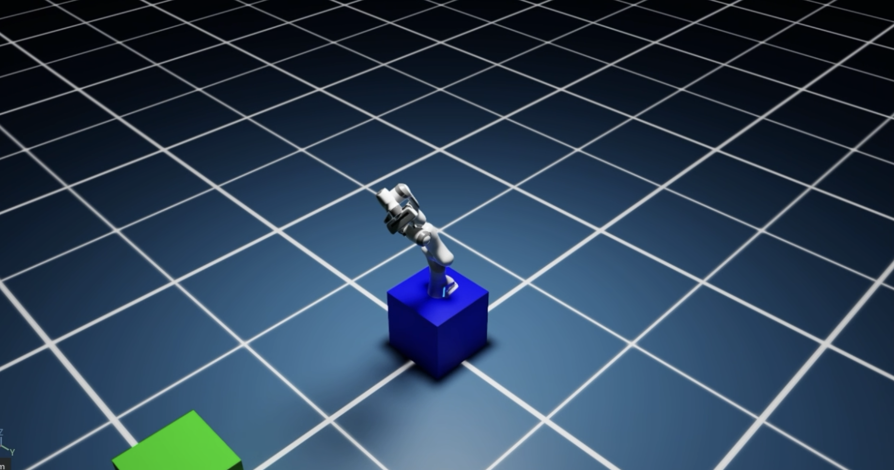
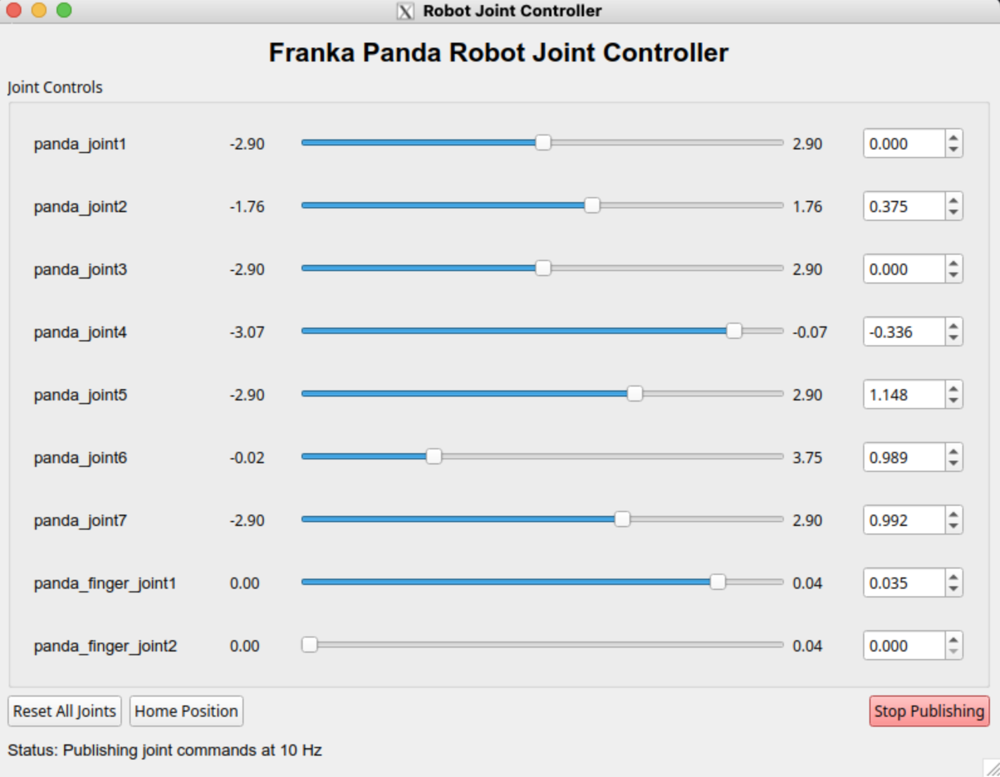
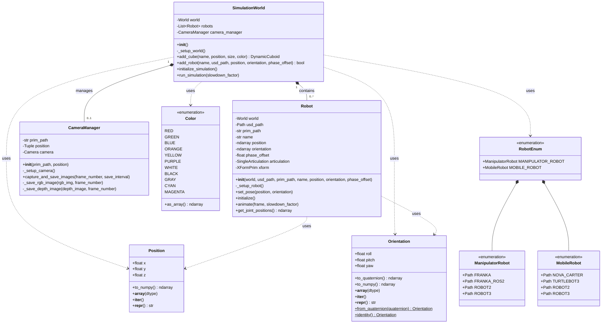

# BiMo
Bi-Manual Mobile Robot

## Overview

This repo uses isaac sim to simulate a bi-manual mobile robot with two Franka Panda arms mounted on a mobile base. The robot can be controlled via ROS2 topics.

## Isaac Sim Franka ROS2

## Robot Joint Controller to Control Franka Panda Arms

# Architecture

